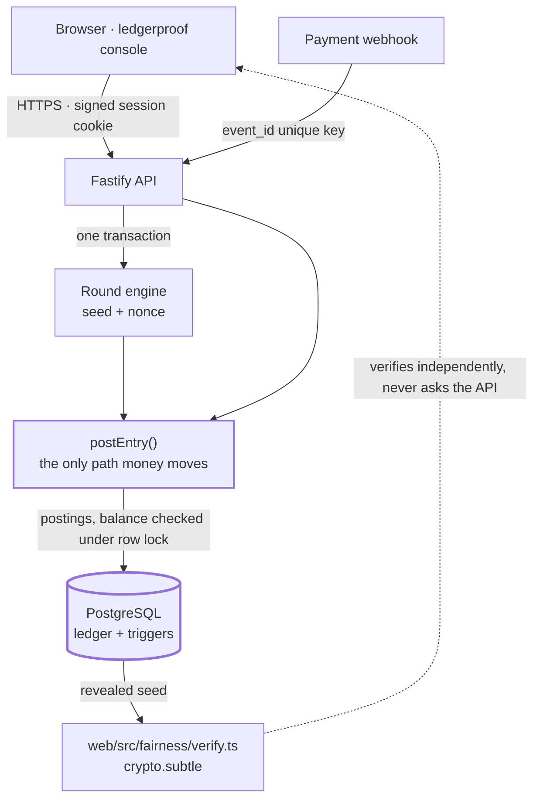

# ledgerproof

A server-authoritative money core whose invariants are tested, not assumed.

[](https://github.com/Shelunagori/provable-settlement-engine/actions/workflows/ci.yml)

A double-entry ledger where no balance is ever stored, payment ingestion that is
idempotent under concurrent duplicate delivery, settlement outcomes anyone can
recompute from published data, and an operator console that shows each of those
holding rather than claiming it.

## What this proves

| Invariant | Authority | Proof |
|---|---|---|
| Σ postings = 0 | Deferred PostgreSQL constraint trigger, checked at `COMMIT` | [`sum_is_zero.test.ts`](api/test/invariants/sum_is_zero.test.ts) |
| Balance is derived | `account_balances` view over `SUM(postings)`; no writable balance column anywhere | [`balance_is_derived.test.ts`](api/test/invariants/balance_is_derived.test.ts) |
| Duplicate payment events post exactly once | `webhook_events.event_id` primary key, `INSERT … ON CONFLICT DO NOTHING` | [`exactly_once.test.ts`](api/test/invariants/exactly_once.test.ts) |
| A user balance never goes negative under concurrency | Account row locks in `postEntry()` plus a cumulative per-debit funds guard | [`never_negative.test.ts`](api/test/invariants/never_negative.test.ts) |
| Outcomes are reproducible from revealed data | Commit-then-reveal seed lifecycle over one exact HMAC encoding | [`deterministic_outcome.test.ts`](api/test/invariants/deterministic_outcome.test.ts) |
| Rounds move open → locked → resolved → settled, only | Service row locks *and* the `rounds_linear` trigger | [`lifecycle_is_linear.test.ts`](api/test/invariants/lifecycle_is_linear.test.ts) |

Each one is explained in full — why it matters, what enforces it, and the
mutation that turns its test red — in **[docs/INVARIANTS.md](docs/INVARIANTS.md)**.

## 60-second tour

Run locally (below) and open the console. The demo is a wagering flow first:

| Step | Do this | What it proves |
|---|---|---|
| 1 | **Reset demo** | Returns the whole demo to a fresh install: no credits, no bets, one active seed |
| 2 | **Add 10 credits** | Money enters as a payment webhook and becomes one balanced journal entry |
| 3 | **Place bet** | The server settles it: result, win or loss, payout, and two more entries |
| 4 | Read the result | Balance updates, and the bet appears under *Recent bets* |
| 5 | **Reveal & verify** | Your browser recomputes the same result with `crypto.subtle`, without asking the server |

Refreshing the browser does **not** reset your wallet. The demo state lives in
PostgreSQL, so credits survive a reload — which is the point: the balance is
server-side, derived from the ledger, and the browser holds none of it. Use
**Reset demo** for a clean environment.

Under *Advanced proofs* the raw evidence is still there: the ledger and journal
with a live balance check and the balance-write refusal (*Ledger*), the
duplicate-payment storm (*Duplicate protection*), every refusal code the server
enforces (*Server rules*), revealed seed history (*Fairness*) and affiliate
accrual (*Affiliate*).

The console is light by default and offers Light / Dark / System, remembered in
`localStorage`. There is no endpoint that stores a theme, and adding one would
mean the interface holding state the server does not know about.

### Demo reset

`POST /demo/reset` exists only when the API is started with:

```
DEMO_RESET_ENABLED=true
```

Without it the route answers 404 like any unknown path. The flag is deliberately
separate from `NODE_ENV`: the public demo runs with `NODE_ENV=production` and
wants the reset, while a real deployment of this engine runs the same way and
must not have it.

The reset takes no parameters — there is no account id to pass, so it cannot be
aimed at anything but the fixed demo dataset. It clears demo activity, reseeds
the chart of accounts and installs one active server seed, all in a single
transaction. It writes no balance and could not: there is no balance column, and
postings stay append-only to every path the product exposes. It is an
environment lifecycle operation, not a financial one.

## Architecture



**PostgreSQL is the financial authority. The console is not.** The frontend
formats values, sums the postings it was handed so the arithmetic is visible,
and verifies fairness cryptographically. It decides nothing: sufficiency of
funds, limits, validity, payout, commission, nonce allocation, round transitions
and idempotency are all server answers. Its own state is one session cookie and
the form fields you are typing into.

## Ledger design

Sign convention: **positive credits an account, negative debits it.** Every
entry sums to zero, and the database rejects one that does not.

```
Deposit 1000              Bet lock 500              Loss settlement 500
  gateway      -1000        user:demo      -500       pending_bets   -500
  user:demo    +1000        pending_bets   +500       treasury       +500

Affiliate commission on that loss     Winning settlement (stake 500, payout 825)
  treasury          -5                  pending_bets   -500
  affiliate:alice   +5                  treasury       -325
                                        user:demo      +825
```

There is no balance column. `balance = SUM(postings.amount_minor)`, computed at
read time — asserted by
[`balance_is_derived.test.ts`](api/test/invariants/balance_is_derived.test.ts).

Payout is `floor(amountMinor × 9900 / targetUnderHundredths)`, computed entirely
in `BigInt`; no decimal appears anywhere in the path.

## Payment idempotency

The arbiter is the primary key on `webhook_events.event_id`:

```sql
INSERT INTO webhook_events (event_id, provider, payload)
VALUES ($1, $2, $3)
ON CONFLICT (event_id) DO NOTHING
RETURNING event_id
```

The transaction that gets a row back owns the event and moves the money; one
that gets nothing back is a duplicate and returns the entry id the winner
committed. This is stronger than `SELECT`-then-`INSERT`, where two deliveries
can both read "absent" before either writes and both then post — a window of
milliseconds whose consequence is a customer credited twice.

Reservation and ledger posting share one transaction, so a failed posting
releases the event id rather than leaving it permanently mistaken for a
duplicate of a payment that never landed.

`POST /demo/webhook-storm` fires 20 real concurrent HTTP requests at the
service's own port: **20 received, 1 posted, 19 deduplicated**. Proven by
[`exactly_once.test.ts`](api/test/invariants/exactly_once.test.ts) and
[`webhook_storm.test.ts`](api/test/webhook_storm.test.ts).

No payment-provider signature verification exists here — see
[out of scope](#production-gaps--out-of-scope).

## Round lifecycle

`open → locked → resolved → settled`, one step at a time.

Each transition asserts its starting status under `SELECT … FOR UPDATE`, so a
caller gets a `ROUND_CLOSED` refusal rather than a constraint violation. The
`rounds_linear` trigger independently rejects any illegal move, including from a
hand-written `UPDATE`. Neither replaces the other.

History is journal entries, not current status:

| Entry | Marks | Postings |
|---|---|---|
| `bet_lock` | locked | 2 |
| `round_resolved` | resolved | **0** — computing an outcome moves no money |
| `bet_settle` | settled | 2 or 3 |

Ordering is by journal id, never timestamp: these are written in one transaction
and `now()` returns the same value for all of them. Proven by
[`lifecycle_is_linear.test.ts`](api/test/invariants/lifecycle_is_linear.test.ts).

## Provably-fair lifecycle

**commit → use → rotate → reveal → verify independently.**

```
serverSeed  32 random bytes as 64 lowercase hex characters
seedHash    SHA256(UTF8(serverSeedText))          published before first use
message     UTF8(`${clientSeed}:${nonce}`)
hmac        HMAC_SHA256(key = UTF8(serverSeedText), message)
roll        parseInt(first 8 hex, 16) % 10000     integer hundredths
win         rollHundredths < targetUnderHundredths
```

> **The seed text is not hex-decoded before hashing or keying.** Both readings
> are defensible and they produce completely different digests. That difference
> is invisible inside one runtime and fatal across two — a verifier that picks
> the other reading reports the service as cheating when it is not.

The nonce is read and incremented under the active seed's row lock, inside the
bet's transaction, so two bets cannot share one and a failed bet returns its
nonce to the sequence. The active plaintext is never served: the query behind
`GET /fairness/seed` does not select that column.

[`web/src/fairness/verify.ts`](web/src/fairness/verify.ts) recomputes outcomes in
the browser with `crypto.subtle`. It does not import the server implementation
and does not call `GET /fairness/verify` — asking the party being checked for the
answer proves nothing. Server, browser and the property oracle all test against
one shared fixture,
[`fixtures/fairness-vectors.json`](fixtures/fairness-vectors.json):
[`deterministic_outcome.test.ts`](api/test/invariants/deterministic_outcome.test.ts),
[`verify.test.ts`](web/src/fairness/verify.test.ts).

## Refusal table

Nine business refusals, each enforced inside the transaction under the relevant
lock: `INSUFFICIENT_FUNDS`, `BET_BELOW_MIN`, `BET_ABOVE_MAX`, `DAILY_LOSS_LIMIT`,
`ROUND_CLOSED`, `DUPLICATE_BET`, `INVALID_TARGET`, `SEED_ROTATED`,
`NOT_AUTHENTICATED`.

Every refusal answers to one shape:

```json
{ "refused": true, "code": "BET_ABOVE_MAX", "message": "Bet 60000 exceeds max 50000", "limit": 50000 }
```

Full table with HTTP statuses and enforcement points:
**[docs/REFUSALS.md](docs/REFUSALS.md)** — generated from
[`api/src/refusals.ts`](api/src/refusals.ts) by `npm run docs:refusals`, with
`npm run docs:check` failing the build on drift. The same object is served by
`GET /refusals` and rendered by the console, so the code is the only source of
truth.

## Property testing

[`api/test/property/random_ops.test.ts`](api/test/property/random_ops.test.ts)
runs 5 fast-check cases of **100–500 randomly generated operations** —
`deposit`, `bet`, `rotate`, `duplicateWebhook` — against the real service and
real PostgreSQL. After **every** operation it re-checks that the ledger balances,
no user is negative, each webhook event maps to exactly one deposit entry,
exactly one seed is active, no two bets share a `(seed_id, nonce)`, and every
settled bet's roll, result and payout match an **independent oracle** written in
the test from the specification.

That oracle imports neither `computeOutcome()` nor `payoutFor()` — importing them
would make the property tautological, since a mutation to production would move
the expected answer with it.

`INSUFFICIENT_FUNDS` and `DAILY_LOSS_LIMIT` are valid parts of a generated
history and are counted, not failed. Anything else aborts the sequence.

## Run locally

```bash
docker compose up -d      # postgres:16, creates pse and pse_test
cp .env.example .env
npm ci
npm run dev               # API on :8080, console on :5173
```

Migrations run automatically on boot and are idempotent — there is no schema to
create by hand.

```bash
npm test                  # API suite against pse_test, plus the web tests
npm run typecheck
npm run build
```

## Deploy

API and PostgreSQL on Railway, console on Vercel. Step-by-step configuration,
required environment variables and the cross-origin session setup are in
**[docs/DEPLOY.md](docs/DEPLOY.md)**.

`/health` answers `200` when the database is reachable and `503` when it is not,
so a platform health probe can actually remove a broken instance from service.

## Production gaps / out of scope

This is a reference implementation of a settlement core, not a complete
regulated stack. Deliberately absent:

- payment-provider signature verification and real settlement rails
- identity and compliance checks, and per-jurisdiction limits
- HSM- or KMS-backed seed custody and key rotation policy
- reconciliation jobs and audit export
- multi-currency and FX
- richer affiliate structures
- production observability, rate limiting and abuse controls

## Decisions

Design trade-offs, the alternatives rejected and why, and the mistakes corrected
along the way: **[docs/DECISIONS.md](docs/DECISIONS.md)**.
